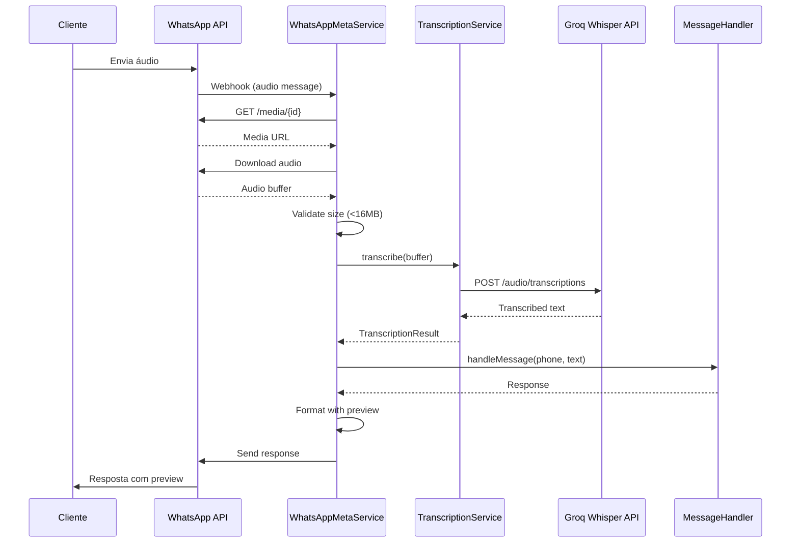

# Design Document: Audio Messages Support

## Overview

Este documento descreve o design para implementar suporte a mensagens de áudio no sistema de atendimento WhatsApp. A solução utiliza a API Groq Whisper para transcrição de áudio, integrando-se ao fluxo existente de processamento de mensagens.

### Goals
- Permitir que clientes enviem mensagens de voz
- Transcrever áudio automaticamente usando Groq Whisper
- Processar texto transcrito pelo handler existente
- Fornecer feedback visual da transcrição ao cliente
- Manter arquitetura modular para futuros providers

### Non-Goals
- Armazenamento de arquivos de áudio
- Suporte a outros tipos de mídia (imagens, vídeos)
- Transcrição em tempo real (streaming)

## Architecture



## Components and Interfaces

### 1. TranscriptionService Interface

```typescript
interface TranscriptionResult {
  success: boolean;
  text?: string;
  duration?: number;
  language?: string;
  error?: TranscriptionError;
}

interface TranscriptionError {
  code: 'DOWNLOAD_FAILED' | 'SIZE_EXCEEDED' | 'TRANSCRIPTION_FAILED' | 'POOR_QUALITY' | 'TIMEOUT';
  message: string;
}

interface AudioMetadata {
  mediaId: string;
  mimeType: string;
  fileSize?: number;
  duration?: number;
}

interface TranscriptionService {
  transcribe(audioBuffer: Buffer, metadata: AudioMetadata): Promise<TranscriptionResult>;
  validateAudio(buffer: Buffer, metadata: AudioMetadata): { valid: boolean; error?: TranscriptionError };
}
```

### 2. GroqTranscriptionProvider

Implementação concreta do TranscriptionService usando Groq Whisper API.

```typescript
class GroqTranscriptionProvider implements TranscriptionService {
  private readonly MAX_FILE_SIZE = 16 * 1024 * 1024; // 16MB
  private readonly TIMEOUT_MS = 30000; // 30 seconds
  private readonly MODEL = 'whisper-large-v3-turbo';
  
  async transcribe(audioBuffer: Buffer, metadata: AudioMetadata): Promise<TranscriptionResult>;
  validateAudio(buffer: Buffer, metadata: AudioMetadata): { valid: boolean; error?: TranscriptionError };
}
```

### 3. WhatsAppMetaService Extensions

Extensões ao serviço existente para suportar áudio:

```typescript
// New methods
async downloadMedia(mediaId: string): Promise<Buffer>;
async handleAudioMessage(message: MetaWebhookMessage): Promise<void>;
formatAudioResponse(transcription: string, botResponse: string): string;
```

### 4. Audio Response Formatter

Formata respostas para mensagens de áudio com preview da transcrição:

```typescript
function formatAudioResponse(transcription: string, botResponse: string): string {
  const preview = truncateWithEllipsis(transcription, 100);
  return `🎤 _"${preview}"_\n\n${botResponse}`;
}
```

## Data Models

### Message Type Extension

O modelo de mensagem existente será estendido:

```prisma
model Message {
  // ... existing fields
  messageType  String   @default("text") // "text" | "audio"
  audioMetadata Json?   // { duration, fileSize, transcription }
}
```

### AudioMetadata JSON Schema

```json
{
  "duration": 15,
  "fileSize": 245000,
  "transcription": "Olá, estou procurando um carro...",
  "transcribedAt": "2025-12-04T10:30:00Z"
}
```

## Correctness Properties

*A property is a characteristic or behavior that should hold true across all valid executions of a system-essentially, a formal statement about what the system should do. Properties serve as the bridge between human-readable specifications and machine-verifiable correctness guarantees.*

### Property 1: Audio Processing Pipeline Integrity

*For any* valid audio message received from WhatsApp, the system SHALL download the audio, pass it to the transcription service, and forward the resulting text to the message handler, producing a response.

**Validates: Requirements 1.1, 1.3, 1.5**

### Property 2: File Size Validation

*For any* audio buffer with size greater than 16MB, the validateAudio function SHALL return `{ valid: false, error: { code: 'SIZE_EXCEEDED' } }`.

**Validates: Requirements 1.2**

### Property 3: Transcription Timeout Enforcement

*For any* transcription request, if the Groq API does not respond within 30 seconds, the transcribe function SHALL return a result with `error.code === 'TIMEOUT'`.

**Validates: Requirements 1.4**

### Property 4: Audio Response Formatting

*For any* successful transcription and bot response, the formatted output SHALL contain the audio indicator emoji, a quoted preview of the transcription (max 100 chars with ellipsis if truncated), and the complete bot response.

**Validates: Requirements 2.1, 2.2, 2.3**

### Property 5: Audio Logging Completeness

*For any* audio message processed (success or failure), the system SHALL log an entry containing: mediaId, fileSize, duration (if available), and error details (if failed).

**Validates: Requirements 3.5, 6.1**

### Property 6: Audio Message Storage Compliance

*For any* transcribed audio message stored in the database, the record SHALL have messageType='audio', SHALL contain the transcription text, and SHALL NOT contain raw audio binary data.

**Validates: Requirements 6.2, 6.3**

## Error Handling

### Error Response Messages

| Error Code | User Message |
|------------|--------------|
| DOWNLOAD_FAILED | "Desculpe, não consegui baixar seu áudio. Pode tentar enviar novamente? 🔄" |
| SIZE_EXCEEDED | "O áudio é muito longo! Por favor, envie um áudio de até 2 minutos ou digite sua mensagem. ⏱️" |
| TRANSCRIPTION_FAILED | "Não consegui entender o áudio. Pode digitar sua mensagem? ✍️" |
| POOR_QUALITY | "O áudio está com qualidade baixa. Pode gravar novamente em um ambiente mais silencioso? 🔇" |
| TIMEOUT | "O processamento demorou muito. Pode tentar novamente ou digitar sua mensagem? ⏳" |

### Error Logging Structure

```typescript
logger.error({
  error: errorCode,
  mediaId: metadata.mediaId,
  fileSize: metadata.fileSize,
  duration: metadata.duration,
  phoneNumber: phoneNumber.substring(0, 8) + '****',
  stack: error.stack,
}, 'Audio processing failed');
```

## Testing Strategy

### Property-Based Testing

O projeto utilizará **fast-check** como biblioteca de property-based testing, consistente com o ecossistema TypeScript/Node.js existente.

Cada property-based test DEVE:
1. Executar no mínimo 100 iterações
2. Ser anotado com comentário referenciando a propriedade do design
3. Usar geradores inteligentes que constrainem o espaço de entrada

### Unit Tests

Testes unitários cobrirão:
- Validação de tamanho de arquivo
- Formatação de resposta com truncamento
- Parsing de webhook de áudio
- Tratamento de erros específicos

### Integration Tests

Testes de integração verificarão:
- Fluxo completo de áudio (com mock do Groq)
- Persistência correta no banco de dados
- Logging com campos obrigatórios

### Test File Structure

```
tests/
├── unit/
│   └── transcription.test.ts
├── properties/
│   └── audio-messages.property.test.ts
└── integration/
    └── audio-flow.test.ts
```
