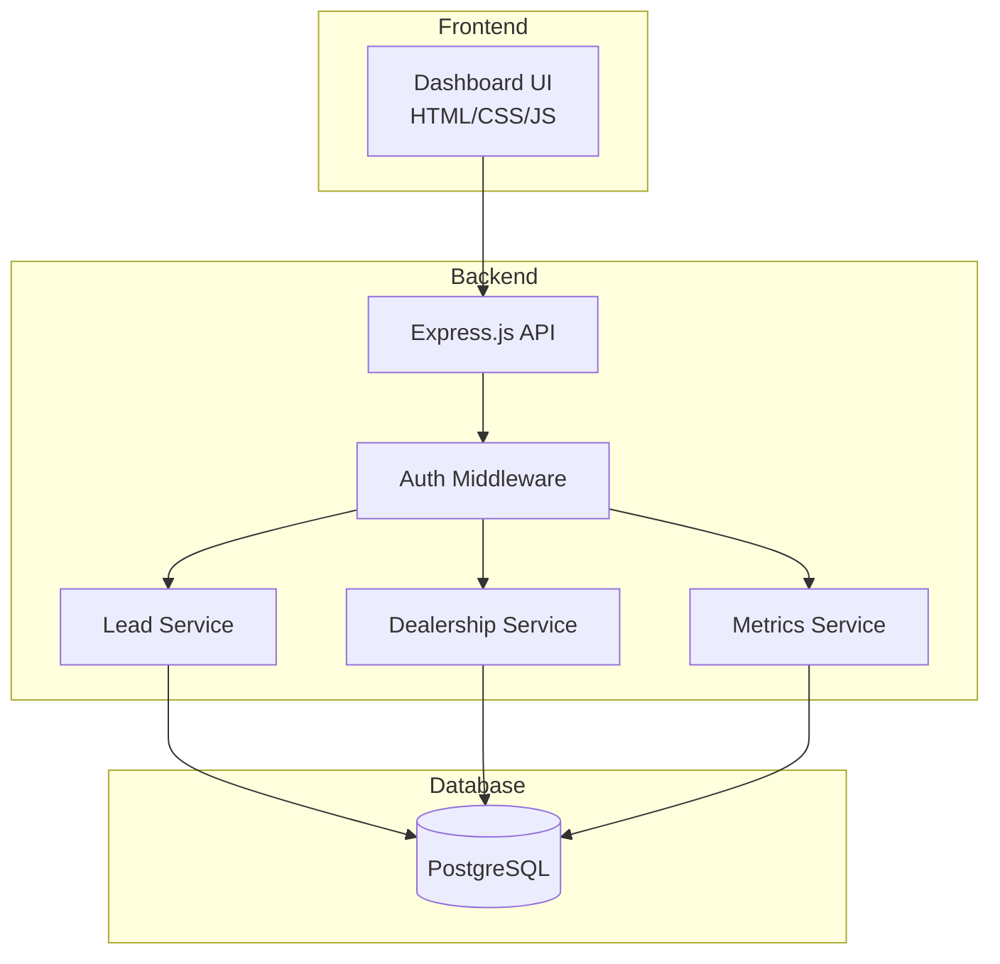
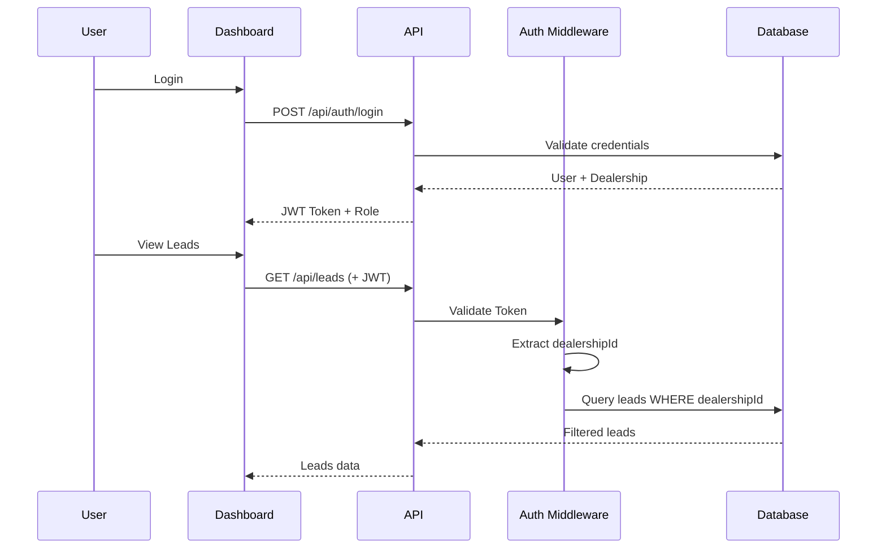

# Design Document: Lead Dashboard Multi-Concessionária

## Overview

O Lead Dashboard é uma aplicação web que permite o acompanhamento e gestão de leads capturados pelo assistente de WhatsApp. O sistema suporta múltiplas concessionárias (multi-tenant), onde cada concessionária tem seus próprios veículos, leads e usuários.

A arquitetura será baseada no backend Express.js existente, adicionando rotas de API REST para o dashboard e uma interface frontend em HTML/CSS/JavaScript vanilla (similar ao dashboard.html existente), mantendo simplicidade e evitando dependências adicionais de frameworks frontend.

## Architecture



### Multi-tenant Data Flow



## Components and Interfaces

### 1. Database Models (Prisma)

#### Dealership Model
```typescript
model Dealership {
  id                String   @id @default(uuid())
  name              String   // "Renatinhu's Cars"
  cnpj              String   @unique
  websiteUrl        String   // "https://www.renatinhuscars.com.br/"
  logoUrl           String?
  sellerWhatsApp    String   // Número do vendedor
  isActive          Boolean  @default(true)
  createdAt         DateTime @default(now())
  updatedAt         DateTime @updatedAt
  
  // Relations
  vehicles          Vehicle[]
  leads             Lead[]
  users             User[]
  conversations     Conversation[]
}
```

#### User Model (Dashboard Access)
```typescript
model User {
  id            String   @id @default(uuid())
  email         String   @unique
  passwordHash  String
  name          String
  role          String   @default("seller") // "admin" | "seller" | "partner"
  dealershipId  String?  // null for admin/partner (access to all)
  isActive      Boolean  @default(true)
  lastLoginAt   DateTime?
  createdAt     DateTime @default(now())
  updatedAt     DateTime @updatedAt
  
  dealership    Dealership? @relation(fields: [dealershipId], references: [id])
}
```

#### Commission Configuration (per Dealership)
```typescript
// Added to Dealership model
model Dealership {
  // ... existing fields ...
  commissionType    String   @default("percentage") // "percentage" | "fixed"
  commissionRate    Float    @default(2.0)          // 2% default or fixed value in BRL
}
```

#### Sale Record (for converted leads)
```typescript
model Sale {
  id            String   @id @default(uuid())
  leadId        String   @unique
  saleValue     Float                              // Valor final da venda
  commissionRate Float                             // Rate at time of conversion
  commissionType String                            // Type at time of conversion
  commissionAmount Float                           // Calculated commission
  isPaid        Boolean  @default(false)           // Commission paid to partner
  paidAt        DateTime?
  createdAt     DateTime @default(now())
  
  lead          Lead     @relation(fields: [leadId], references: [id])
}
```

### 2. API Endpoints

#### Authentication
```typescript
POST /api/auth/login
  Body: { email: string, password: string }
  Response: { token: string, user: { id, name, role, dealershipId } }

POST /api/auth/logout
  Headers: Authorization: Bearer <token>
  Response: { success: true }
```

#### Leads
```typescript
GET /api/leads
  Query: { 
    page?: number,
    limit?: number,
    status?: string,
    dealershipId?: string, // admin only
    startDate?: string,
    endDate?: string,
    search?: string,
    vehicleId?: string
  }
  Response: { 
    leads: Lead[],
    total: number,
    page: number,
    totalPages: number
  }

GET /api/leads/:id
  Response: Lead with vehicle and conversation details

PATCH /api/leads/:id/status
  Body: { status: string, notes?: string }
  Response: Updated Lead
```

#### Metrics
```typescript
GET /api/metrics
  Query: { 
    dealershipId?: string,
    startDate?: string,
    endDate?: string
  }
  Response: {
    totalLeads: number,
    byStatus: { pending: n, sent: n, contacted: n, converted: n, lost: n },
    conversionRate: number,
    avgResponseTime: number, // minutes
    byDealership?: { dealershipId: string, name: string, count: number }[]
  }

GET /api/metrics/partner (partner only)
  Query: { 
    startDate?: string,
    endDate?: string
  }
  Response: {
    totalConverted: number,
    totalSalesValue: number,
    totalCommissionEarned: number,
    commissionPending: number,
    commissionPaid: number,
    byDealership: { 
      dealershipId: string, 
      name: string, 
      converted: number,
      salesValue: number,
      commission: number 
    }[]
  }
```

#### Sales (for commission tracking)
```typescript
POST /api/leads/:id/sale (admin/seller)
  Body: { saleValue: number }
  Response: { lead: Lead, sale: Sale }

GET /api/sales (partner)
  Query: { 
    startDate?: string,
    endDate?: string,
    dealershipId?: string,
    isPaid?: boolean
  }
  Response: { 
    sales: Sale[],
    total: number,
    page: number,
    totalPages: number
  }
```

#### Dealerships (Admin only)
```typescript
GET /api/dealerships
  Response: Dealership[]

POST /api/dealerships
  Body: { name, cnpj, websiteUrl, logoUrl?, sellerWhatsApp }
  Response: Dealership

PATCH /api/dealerships/:id
  Body: Partial<Dealership>
  Response: Dealership
```

#### Export
```typescript
GET /api/leads/export
  Query: { format: 'csv', ...filters }
  Response: CSV file download
```

### 3. Services

#### AuthService
```typescript
interface AuthService {
  login(email: string, password: string): Promise<{ token: string, user: User }>
  validateToken(token: string): Promise<User | null>
  hashPassword(password: string): Promise<string>
  comparePassword(password: string, hash: string): Promise<boolean>
}
```

#### LeadService
```typescript
interface LeadService {
  findAll(filters: LeadFilters, userId: string): Promise<PaginatedResult<Lead>>
  findById(id: string, userId: string): Promise<Lead | null>
  updateStatus(id: string, status: string, userId: string): Promise<Lead>
  getTimeline(id: string): Promise<LeadEvent[]>
  exportToCsv(filters: LeadFilters, userId: string): Promise<string>
}
```

#### MetricsService
```typescript
interface MetricsService {
  getDashboardMetrics(filters: MetricFilters, userId: string): Promise<DashboardMetrics>
  getConversionRate(dealershipId?: string, dateRange?: DateRange): Promise<number>
  getAverageResponseTime(dealershipId?: string, dateRange?: DateRange): Promise<number>
}
```

### 4. Frontend Components

#### Dashboard Layout
- Header com logo, seletor de concessionária (admin), e menu do usuário
- Sidebar com navegação: Leads, Métricas, Concessionárias (admin)
- Main content area com cards de métricas e tabela de leads

#### Lead Table Component
- Colunas: Concessionária, Cliente, Telefone, Veículo, Status, Data
- Ações: Ver detalhes, Alterar status, WhatsApp
- Paginação e filtros

#### Metrics Cards
- Total de Leads
- Taxa de Conversão
- Tempo Médio de Resposta
- Gráfico de funil por status

## Data Models

### LeadFilters
```typescript
interface LeadFilters {
  page: number
  limit: number
  status?: 'pending' | 'sent' | 'contacted' | 'converted' | 'lost'
  dealershipId?: string
  startDate?: Date
  endDate?: Date
  search?: string
  vehicleId?: string
}
```

### DashboardMetrics
```typescript
interface DashboardMetrics {
  totalLeads: number
  byStatus: Record<string, number>
  conversionRate: number
  avgResponseTime: number
  byDealership?: Array<{
    dealershipId: string
    name: string
    count: number
    conversionRate: number
  }>
}

interface PartnerMetrics {
  totalConverted: number
  totalSalesValue: number
  totalCommissionEarned: number
  commissionPending: number
  commissionPaid: number
  byDealership: Array<{
    dealershipId: string
    name: string
    converted: number
    salesValue: number
    commission: number
  }>
}
```

### LeadEvent (Timeline)
```typescript
interface LeadEvent {
  id: string
  leadId: string
  eventType: 'created' | 'status_changed' | 'note_added'
  previousValue?: string
  newValue?: string
  userId?: string
  timestamp: Date
}
```


## Correctness Properties

*A property is a characteristic or behavior that should hold true across all valid executions of a system-essentially, a formal statement about what the system should do. Properties serve as the bridge between human-readable specifications and machine-verifiable correctness guarantees.*

### Property 1: Multi-tenant Data Isolation
*For any* seller user and any query to the leads API, all returned leads SHALL belong to the user's associated dealership only.
**Validates: Requirements 1.3, 7.3**

### Property 2: Dealership ID Uniqueness
*For any* set of created dealerships, all dealership IDs SHALL be unique.
**Validates: Requirements 1.2**

### Property 3: Lead Ordering
*For any* list of leads returned by the API, the leads SHALL be ordered by capturedAt in descending order (most recent first).
**Validates: Requirements 2.1**

### Property 4: Lead Display Completeness
*For any* lead returned by the API, the response SHALL include: dealershipId, customerName, customerPhone, vehicleId, status, and capturedAt.
**Validates: Requirements 2.2**

### Property 5: Pagination Correctness
*For any* query with pagination parameters (page, limit), the returned leads count SHALL not exceed the limit, and total/totalPages SHALL be mathematically consistent.
**Validates: Requirements 2.4**

### Property 6: Filter Correctness
*For any* combination of filters (status, dateRange, search, vehicleId, dealershipId), all returned leads SHALL satisfy ALL applied filter conditions.
**Validates: Requirements 3.1, 3.2, 3.3, 3.4, 3.5, 3.6**

### Property 7: Status Update Persistence
*For any* lead status update, querying the lead immediately after SHALL return the new status value.
**Validates: Requirements 4.2**

### Property 8: ContactedAt Timestamp
*For any* lead whose status changes to "contacted", the contactedAt field SHALL be set to a timestamp within 1 second of the update time.
**Validates: Requirements 4.3**

### Property 9: Metrics Total Consistency
*For any* metrics query, the sum of byStatus counts SHALL equal totalLeads.
**Validates: Requirements 5.1, 5.2**

### Property 10: Conversion Rate Calculation
*For any* metrics query, conversionRate SHALL equal (converted count / totalLeads) when totalLeads > 0, or 0 when totalLeads = 0.
**Validates: Requirements 5.3**

### Property 11: Average Response Time Calculation
*For any* set of contacted leads, avgResponseTime SHALL equal the mean of (contactedAt - capturedAt) in minutes.
**Validates: Requirements 5.4**

### Property 12: Authentication Rejection
*For any* API request without a valid JWT token, the API SHALL return 401 Unauthorized.
**Validates: Requirements 7.1**

### Property 13: Valid Login Token
*For any* valid email/password combination, the login endpoint SHALL return a JWT token that can be used for subsequent authenticated requests.
**Validates: Requirements 7.2**

### Property 14: Admin Access All Dealerships
*For any* admin user, querying leads with any dealershipId filter SHALL return leads from that dealership.
**Validates: Requirements 7.4**

### Property 15: Token Expiration
*For any* JWT token older than 8 hours, the API SHALL reject the request with 401 Unauthorized.
**Validates: Requirements 7.5**

### Property 16: Phone Number Masking
*For any* phone number displayed in the API response, the middle digits SHALL be masked (format: XX X****-XXXX).
**Validates: Requirements 7.6**

### Property 17: Export Filter Consistency
*For any* export request with filters, the exported CSV data SHALL contain exactly the same leads as a regular query with the same filters.
**Validates: Requirements 8.1, 8.2, 8.3**

### Property 18: Partner View Shows All Dealerships
*For any* partner user, querying leads SHALL return leads from all dealerships (not filtered by dealershipId).
**Validates: Requirements 10.1**

### Property 19: Partner Default Filter Converted
*For any* partner user accessing the dashboard without explicit status filter, the default view SHALL show only leads with status "converted".
**Validates: Requirements 10.2**

### Property 20: Commission Calculation Percentage
*For any* sale with commission type "percentage", the commission amount SHALL equal (saleValue × commissionRate / 100).
**Validates: Requirements 10.4, 11.2**

### Property 21: Commission Calculation Fixed
*For any* sale with commission type "fixed", the commission amount SHALL equal the configured fixed rate.
**Validates: Requirements 10.4, 11.3**

### Property 22: Partner Metrics Totals Consistency
*For any* partner metrics query, totalCommissionEarned SHALL equal the sum of all commission amounts, and commissionPending + commissionPaid SHALL equal totalCommissionEarned.
**Validates: Requirements 10.5**

### Property 23: Commission Rate Immutability
*For any* existing sale record, updating the dealership commission rate SHALL NOT change the commission amount of that sale.
**Validates: Requirements 11.5**

## Error Handling

### API Error Responses
```typescript
interface ApiError {
  status: number
  code: string
  message: string
  details?: Record<string, any>
}

// Error codes
const ErrorCodes = {
  UNAUTHORIZED: 'UNAUTHORIZED',           // 401 - Invalid/missing token
  FORBIDDEN: 'FORBIDDEN',                 // 403 - No access to resource
  NOT_FOUND: 'NOT_FOUND',                 // 404 - Resource not found
  VALIDATION_ERROR: 'VALIDATION_ERROR',   // 400 - Invalid input
  INTERNAL_ERROR: 'INTERNAL_ERROR',       // 500 - Server error
}
```

### Error Scenarios
1. **Invalid Token**: Return 401 with UNAUTHORIZED code
2. **Seller accessing other dealership**: Return 403 with FORBIDDEN code
3. **Lead not found**: Return 404 with NOT_FOUND code
4. **Invalid status value**: Return 400 with VALIDATION_ERROR code
5. **Database connection failure**: Return 500 with INTERNAL_ERROR code, log full error

## Testing Strategy

### Property-Based Testing Library
- **Library**: fast-check (TypeScript)
- **Minimum iterations**: 100 per property test

### Unit Tests
- AuthService: login, token validation, password hashing
- LeadService: CRUD operations, filtering, pagination
- MetricsService: calculations, aggregations
- Phone masking utility function

### Property-Based Tests
Each correctness property will be implemented as a property-based test using fast-check:

1. **Multi-tenant isolation**: Generate random seller users and leads, verify isolation
2. **Filter correctness**: Generate random filter combinations, verify all results match
3. **Pagination**: Generate random page/limit values, verify mathematical consistency
4. **Metrics calculations**: Generate random lead sets, verify calculations
5. **Token expiration**: Generate tokens with various ages, verify rejection

### Integration Tests
- Full authentication flow (login → access → logout)
- Lead CRUD with multi-tenant context
- Export functionality with filters

### Test Annotations
Each property-based test MUST include a comment in this format:
```typescript
// **Feature: lead-dashboard, Property 1: Multi-tenant Data Isolation**
```
